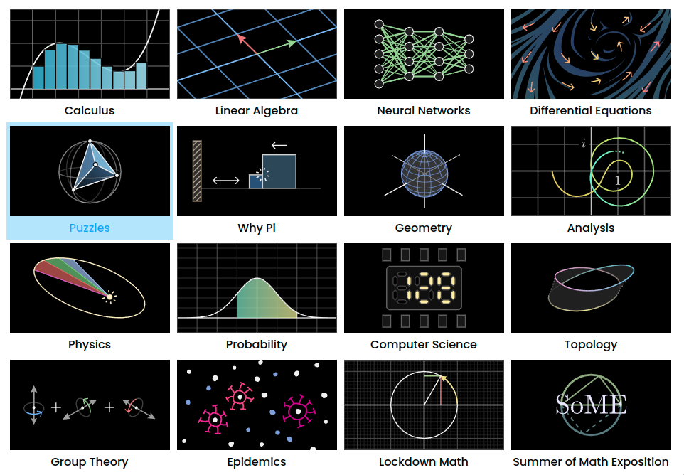
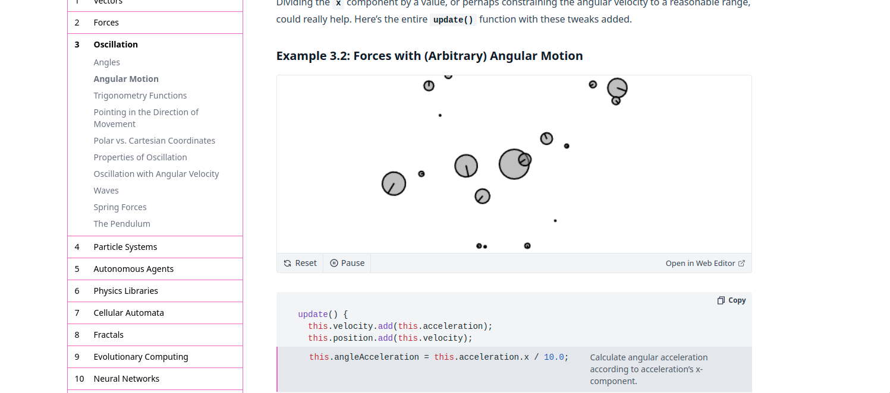

# [**CodeQuest**](https://codequest.cublueprint.org) Event Planning

## Event Title

**^^CodeQuest 2024: Algorithm Visualization Challenge^^** (AlgoViz)

## The Challenge

Participants are asked to create a graphically engaging animation to visualize an algorithm of their choosing.
Here is a [a set of suggested algorithms](#algorithms) as an inspiration for what participants can choose from *(or not. If you have a better algo, use that!)*

They will be judged on the quality of their visualization and the correctness or complexity of their implementation.

### Algorithms

Some preliminary ideas (to be majorly refined):

COMP 1805
:   - Breadth First Search

COMP 2402
:   - Heapify
    - Array Mutation

COMP 2804
:   - 00-free bitstrings
    - Group into 2 sets

COMP 3804
:   - Kruskal's/Prim's Minimum Spanning Tree (MST)
    - Dijsktra's Algorithm (Shortest Path)
    - Longest Increasing Subsequence (LIS)

!!! note "Faculty Involvement"
    - Consider the possibility of involving faculty members and professors in the challenge creation or in the wider event.

### Examples

**15 Sorting Algorithms in 6 Minutes**

:   <iframe width="560" height="315" src="https://www.youtube.com/embed/kPRA0W1kECg?si=abrV53gr4EgPbv_h" title="YouTube video player" frameborder="0" allow="accelerometer; autoplay; clipboard-write; encrypted-media; gyroscope; picture-in-picture; web-share" referrerpolicy="strict-origin-when-cross-origin" allowfullscreen></iframe>

**Infinite Sum Explain Visually**

:   <iframe width="560" height="315" src="https://www.youtube.com/embed/-y1Ob0K63hc?si=UywgJqvQhf9z22Qd&amp;start=77" title="YouTube video player" frameborder="0" allow="accelerometer; autoplay; clipboard-write; encrypted-media; gyroscope; picture-in-picture; web-share" referrerpolicy="strict-origin-when-cross-origin" allowfullscreen></iframe>

**[3blue1brown's Lessons](https://www.3blue1brown.com/)**

**Daniel Shiffman's [The Nature of Code](https://natureofcode.com/)**

**James's COMP 2402 Visualizations** *(TA @ Prof. Alina Shaikhet)*

:   - [SnakeLadderViz by voidranjer](https://editor.p5js.org/voidranjer/full/jzAUCf0Gd)
    - [HeapViz by voidranjer](https://editor.p5js.org/voidranjer/full/Pr-L2w8HW)

### Suggested Technologies

{{ read_csv("suggested_tech.csv") }}

### Algorithm Sources

Algorithms will be drawn from the following list of courses:

{{ read_csv("cu_classes.csv") }}

Additional detail about these courses can be found on [Carleton's Undergraduate Computer Science Courses page](https://calendar.carleton.ca/undergrad/undergradprograms/computerscience/).

!!! info "A note on difficulty levels"
    When selecting algorithms, be judicious to select those that are **inclusive** and **approachable** *(especially for lower-year students)* but not trivial--they should be challenging enough to require some thought and **creativity** to visualize.

## Stakeholders

**Carleton CUSEC Society (CCS)**

:   - Primary organizer
    - Fund [prizes](#incentives) for winners

**Carleton Blueprint**

**cuHacking**

**Carleton Computer Science Society (CCSS)**

:   - Organizer
    - Logistical support
    - Marketing support
    - Provide judges

## Incentives

**For Organizers**

Exclusive CUSEC sponsor

**For Participants**

"Everyone who participates is a winner" mindset

:   - Resume: Participation Certificate (notarized by SSSC)
    - Showcase Gallery: https://thecodingtrain.com/showcase
    - Submission of gallery to CUSEC sponsors

**Winners**

:   CUSEC tickets

## Timeline

[CUSEC 2025](https://2025.cusec.net/) will happen from **January 9-11, 2025**.

## Judging

- CCSS, cuHacking, CUSEC, Blueprint

## Cheating Policy

- Presentation? Explain code

## Scattered notes (pls ignore)

Interactive/Non-interactive

 ---- two formats: voiceover video or writeup with video demo

